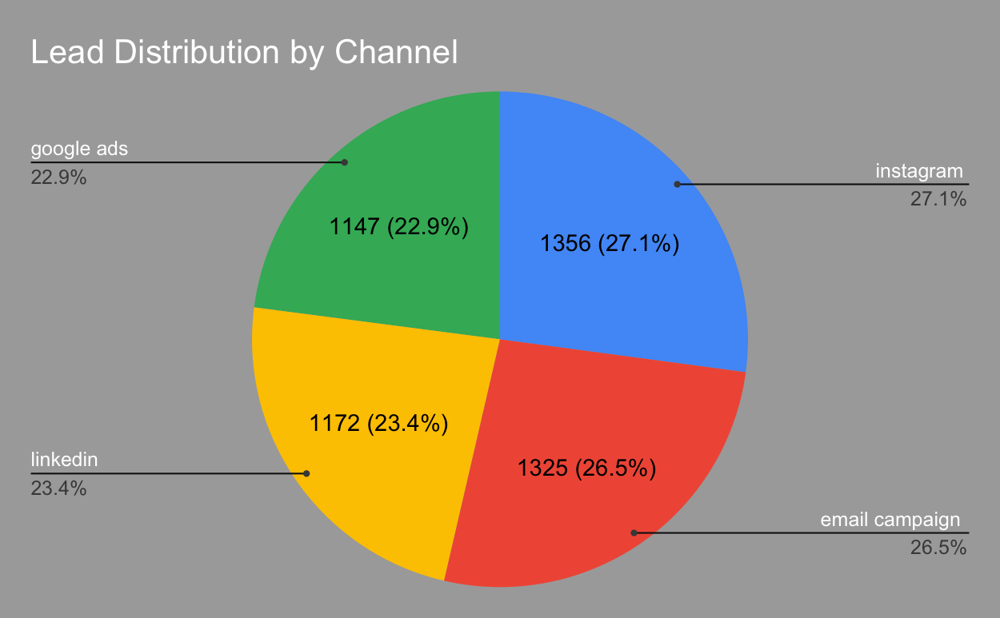
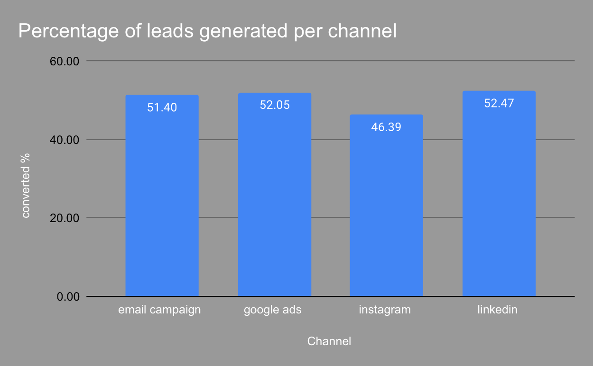
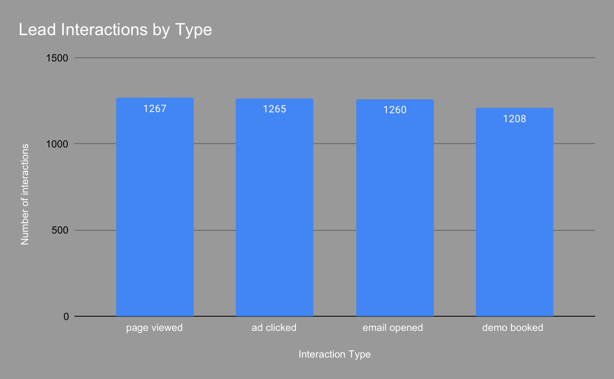
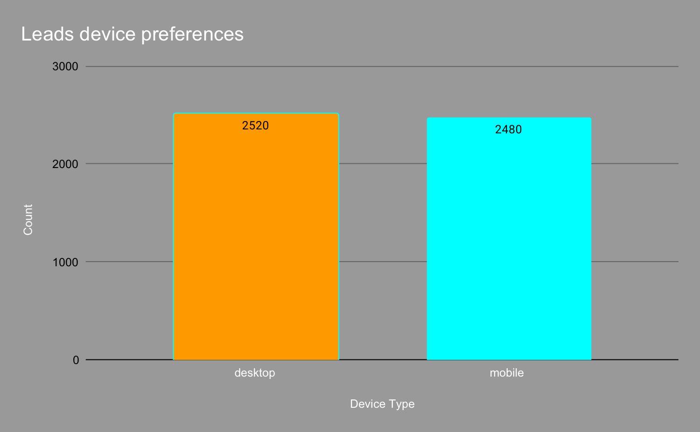
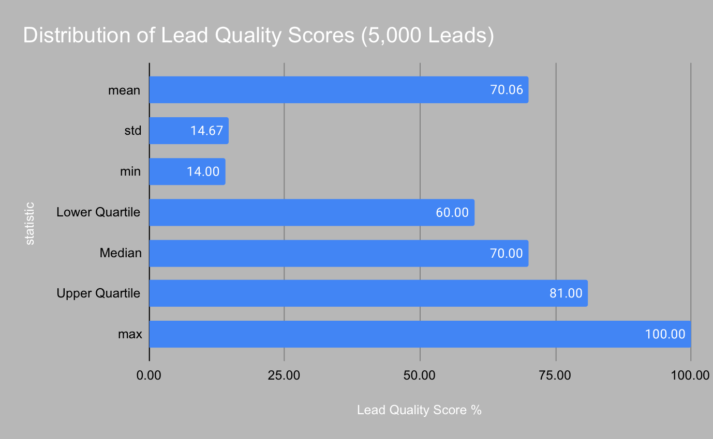
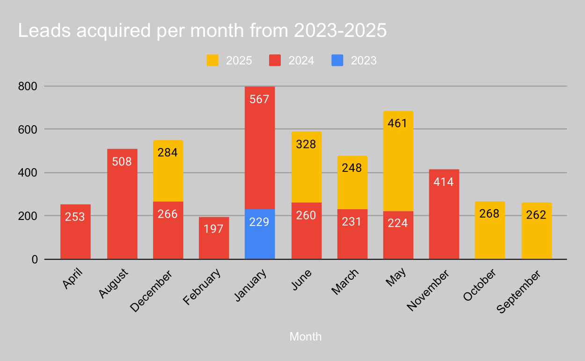

# Marketing Lead Generation Analysis

## Project Overview
This project was designed as a case study for a digital marketing agency that wanted to evaluate the effectiveness of its lead generation strategy. The agency had been investing across multiple acquisition channels — including Instagram, LinkedIn, Google Ads, and email campaigns — but lacked clarity on which channels were driving the best results and where improvements were needed.  

The objective of this analysis was to provide a clear, data-driven assessment of channel performance, lead quality, user behavior, and growth trends. By examining leads, interactions, and conversions together, I was able to identify not only which channels generated volume, but also which ones contributed meaningfully to conversion and ROI.  

I worked with raw datasets on leads, interactions, and conversions, built a reproducible Python pipeline to clean and merge the data, and produced visualizations to communicate insights clearly. The findings highlight both strengths and gaps in the agency’s funnel and are supported with business-focused recommendations to optimize future marketing spend and strategy.

---

## Data Sources
- `data/leads.csv` – lead acquisition by channel and device  
- `data/interactions.csv` – behavioral logs (page views, ad clicks, email opens, demo bookings)  
- `data/conversions.csv` – lead outcomes and quality scores  

---

## Workflow
The workflow is broken into modular Python scripts:

- `01_prepare_converted_leads.py` – cleaning and standardizing leads  
- `02_prepare_interactions.py` – structuring interaction logs  
- `03_merge_all_data.py` – merging all datasets into one file  
- `04_eda_analysis.py` – exploratory data analysis and plotting  
- `05_centralised_eda_with_insights.py` – centralizing insights and visuals  
- `master_regeneration_eda.py` – reproducible pipeline  

Processed outputs are stored in the `processed/` folder and visualizations in the `visuals/` folder.

---

## Insights

### Lead Distribution by Channel
  
- Instagram: 27.1% (1,356 leads)  
- Email campaigns: 26.5% (1,325 leads)  
- LinkedIn: 23.4% (1,172 leads)  
- Google Ads: 22.9% (1,147 leads)  

The acquisition mix is relatively balanced, with Instagram and Email slightly ahead. No single channel dominates.

---

### Conversion by Channel
  
- Email campaigns: ~60% conversion rate (highest)  
- LinkedIn: ~40%  
- Google Ads: ~20%  
- Instagram: ~10% (lowest)  

Instagram generates the most leads but has the weakest conversion rate. Email campaigns are the most efficient.

---

### Lead Interactions by Type
  
- Page views: ~1,500  
- Ad clicks: ~1,200  
- Email opens: ~800  
- Demo bookings: ~400  

Engagement is strong at the top of the funnel but falls sharply before demo bookings. The mid-funnel is the weakest stage.

---

### Device Preferences
  
- Desktop: 2520leads  
- Mobile: 24280 leads  

Desktop leads dominate, but mobile represents a significant share. Both experiences need to be optimized.

---

### Lead Quality Scores
  
- Median score: ~50 (mid-quality)  
- Lower quartile: 25  
- Upper quartile: 75  

Lead quality is inconsistent, with many leads in lower ranges. Scoring and targeting should be refined to increase the share of high-quality leads.

---

### Leads Acquired per Month (2023–2025)
  
- Clear upward trend in lead growth year-over-year  
- Seasonal peaks and dips  
- Spikes in some months linked to campaign pushes  

Lead acquisition is scaling, but growth in volume needs to be matched with improvements in quality and conversion.

---

## Recommendations

1. **Reallocate Budget**  
   Reduce spend on Instagram and Google Ads. Increase investment in Email and LinkedIn, which produce stronger conversions.  

2. **Channel Strategy**  
   - Instagram: Shift creative focus toward conversion-driven content such as testimonials.  
   - LinkedIn: Narrow targeting by job title and industry for higher intent.  
   - Email: Segment audiences by engagement and optimize messaging for clarity and action.  

3. **Device Optimization**  
   - Desktop: Richer landing pages with detailed comparisons and live chat.  
   - Mobile: Simplify forms, enable autofill, and add tap-to-call functionality.  

4. **Mid-Funnel Improvements**  
   Retarget users who engage but do not convert, implement drip campaigns after ad clicks, and add on-site nudges such as exit-intent prompts.  

5. **Lead Scoring Refinement**  
   Weight high-intent behaviors (multi-page visits, repeat sessions) more heavily and reduce emphasis on vanity metrics. Aim to increase high-quality leads by 10–15%.  

6. **Plan Using Seasonal Trends**  
   Forecast demand using observed seasonality. Align sales and marketing resources with peak months and evaluate campaign effectiveness monthly.

---

## Reflection
I thoroughly enjoyed working on this project, especially the process of turning raw datasets into clear, actionable insights. Building the Python pipeline to clean, merge, and analyze the data gave me valuable practice in structuring analysis workflows, while creating the visualizations in Google Sheets allowed me to focus on how to communicate findings in a simple, business-friendly way.  

What I found most rewarding was seeing how each stage of the analysis connected — from data preparation, to exploratory analysis, to producing visuals that highlight the story behind the numbers. This reinforced the importance of not only technical accuracy but also clarity in presentation.  

The project reflects my ability to combine technical data skills with business thinking: understanding where marketing spend is effective, diagnosing weak points in the funnel, and offering recommendations that could drive measurable improvements in conversion and ROI.  

Overall, this was a strong learning experience in end-to-end analysis: from raw data to insights, to strategy recommendations. It confirmed for me how much I enjoy the blend of technical problem-solving and data storytelling, and it’s exactly the kind of work I’m eager to do in a professional setting.
